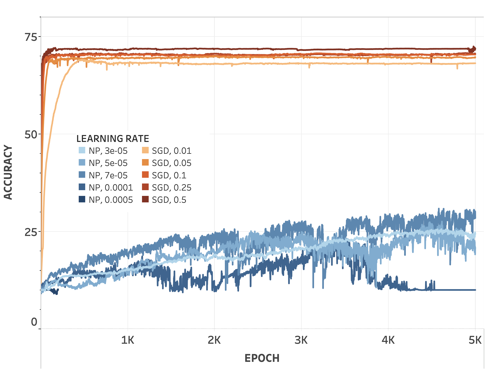
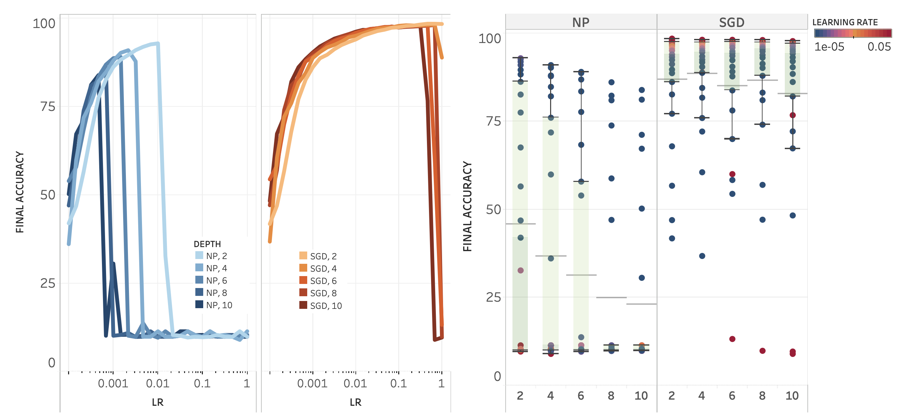
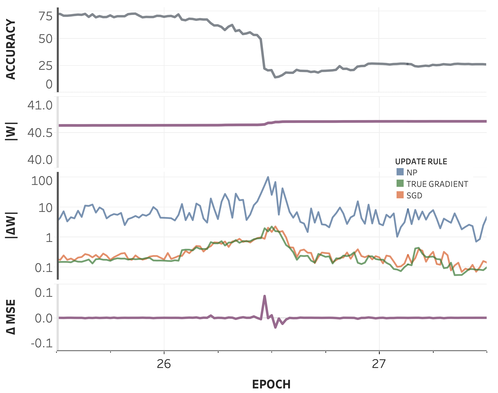

# Running Experiments in the Paper

## Learning Trajectories for NodePert and SGD

   

The left fig above (```learning-curves-fc.png```) shows the comparison between the learning trajectories of nodepert and SGD at different learning rates. 20 runs with each job id corresponding to a particular learning rate as defined in ```vary_lr.py```.
>```python
>python experiments/vary_lr.py -log_expdata True -n_hl 2 -hl_size 500 -num_epochs 200 -update_rule [np-sgd] -jobid [0-9]
>```
The figure on the right (```learning-curves-conv.png```), above compares the learning trajectories of nodepert and SGD on a large convolutional network (AllCNN net ~200K neurons) on CIFAR10, when trained for 5000 epochs. You need to have the setup running on a GPU for this experiment to finish before humans become a multiplanetary species. Again, different jobids are corresponding to different learning rates as defined in ```All_CNN_A.py```.
>```python
>python experiments/conv/All_CNN_A.py -log_expdata True -num_epochs 5000 -update_rule [np-sgd] -jobid [0-9]
>```

## Scaling with Depth and Width of a FC Network



In the figure above (```depth-scaling.png```), we fix the training budget (we train all architectures for 200 epochs) and plot the final test accuracies (average of the last 5 epochs) of different architectures across 50 uniformly sampled learning rates in the log interval of {10−4, 1}. The figure above shows the scaling of NP across network depth for a fully connected network on MNIST. As usual, different jobids are corresponding to different learning rates as defined in ```depth.py```.

>```python
> python experiments/scaling/depth.py -log_expdata True -n_hl 2 -hl_size 500 -num_epochs 200 -update_rule [np-sgd] -jobid [0-49]
> python experiments/scaling/depth.py -log_expdata True -n_hl 4 -hl_size 500 -num_epochs 200 -update_rule [np-sgd] -jobid [0-49]
> python experiments/scaling/depth.py -log_expdata True -n_hl 6 -hl_size 500 -num_epochs 200 -update_rule [np-sgd] -jobid [0-49]
> python experiments/scaling/depth.py -log_expdata True -n_hl 8 -hl_size 500 -num_epochs 200 -update_rule [np-sgd] -jobid [0-49]
> python experiments/scaling/depth.py -log_expdata True -n_hl 10 -hl_size 500 -num_epochs 200 -update_rule [np-sgd] -jobid [0-49]
>```

Similar plot for scaling with network width:
>```python
> python experiments/scaling/width.py -log_expdata True -n_hl 1 -hl_size 100 -num_epochs 200 -update_rule [np-sgd] -jobid [0-49]    
> python experiments/scaling/width.py -log_expdata True -n_hl 1 -hl_size 500 -num_epochs 200 -update_rule [np-sgd] -jobid [0-49]    
> python experiments/scaling/width.py -log_expdata True -n_hl 1 -hl_size 1000 -num_epochs 200 -update_rule [np-sgd] -jobid [0-49]    
> python experiments/scaling/width.py -log_expdata True -n_hl 1 -hl_size 5000 -num_epochs 200 -update_rule [np-sgd] -jobid [0-49]    
> python experiments/scaling/width.py -log_expdata True -n_hl 1 -hl_size 10000 -num_epochs 200 -update_rule [np-sgd] -jobid [0-49]    
>```

## Crash Dynamics
 

We regularly observe crashes while training the network with NP, want to look deeply into what is going on by very finely (at every minibatch update) measuring how the training parameters are changing. Left figure (```crash-dynamics.png```):
>```python
>python experiments/crash_dynamics.py -log_expdata True -n_hl 3 -hl_size 500 -num_epochs 500 -update_rule np -jobid [0-19]  
>```
Fig on the right (```crash-timing-var.png```) shows the variance in when (epoch number) the crash occurs as we fluctuate the learning rate.
>```python
>python experiments/crash_timing.py -log_expdata True -n_hl 3 -hl_size 500 -num_epochs 5000 -update_rule sgd -jobid [0-19]    
>```
